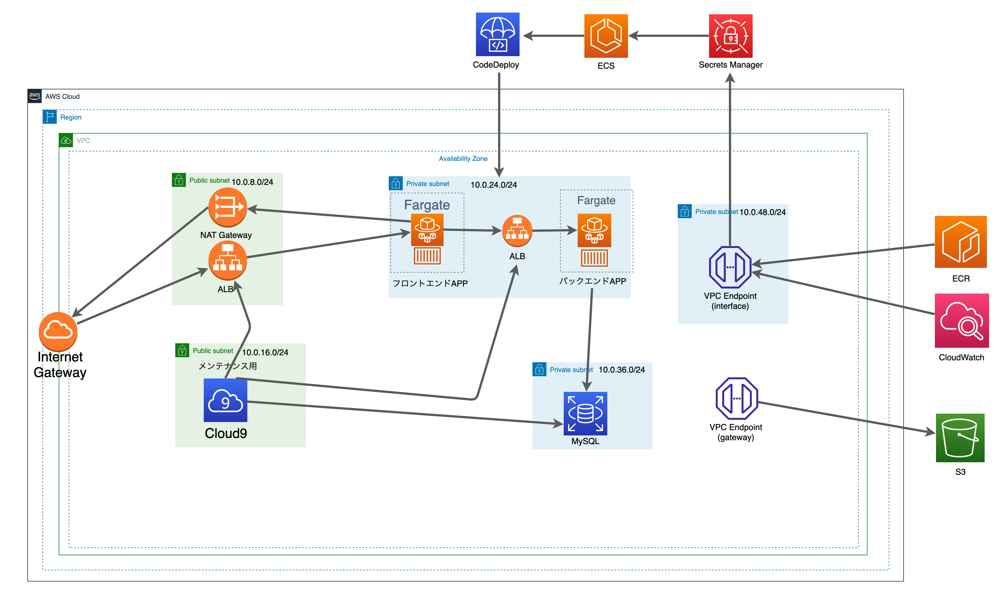

# CyclingRouter
自分のサイクリングコースを他の人とシェアするWebサービス。
SNS機能もあるので、他のユーザーとも交流が可能です。
## 技術Stack
Frontend: Next.js, TypeScript  
Backend: Go, MySQL  
Infraなど: Git, GitHub, Docker, JWT認証, AWS(S3, CloudFront)  
外部API: Google Maps API  

## 実装機能
* ルート関係
  * グーグルMaps APIを用いてルート検索
  * 地図検索
  * ルートの保存(説明, サムネイルの登録)
  * ルートの削除
* 他の人が作成したルート一覧
* フォロー
* タイムライン
  * 投稿機能
  * コメント機能
  * いいね機能
* プロフィール機能
  * 年齢、ユーザーネーム等の基本事項の登録
  * ツイート一覧
  * 投稿した経路一覧
